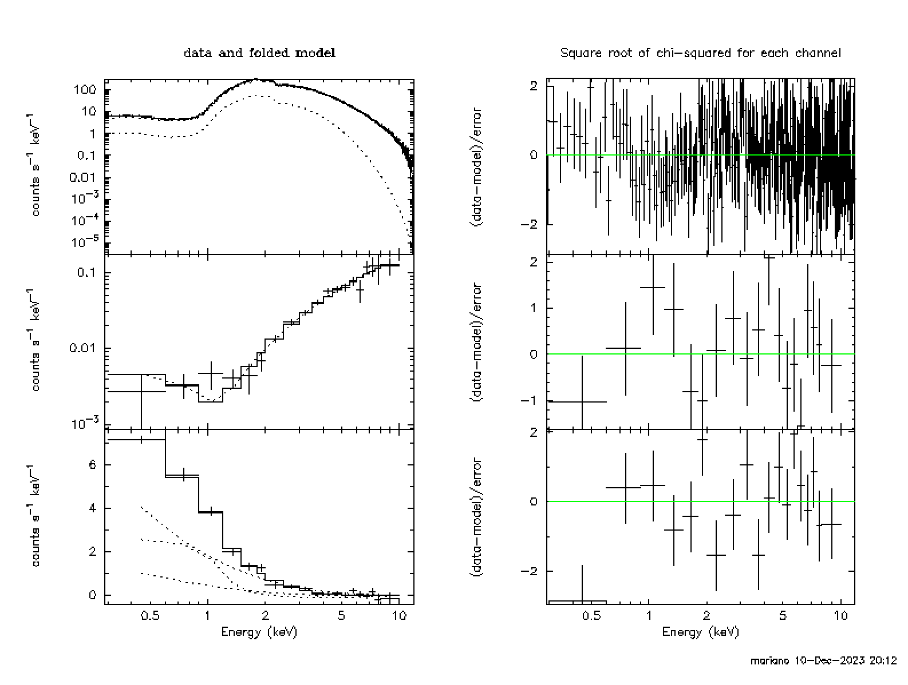

# Example of how to use the model to fit the spectrum of the source plus the rms and lag spectra of the QPO

We assume that you followed the instructions and you were able to compile and load the model

If you haven't done it yet, please run first the examples in the folder `MAXI_J1348-630`. 
The exmaples here are a bit more complex than those. 

We provide a number of files under the subdirectory `DILUTION/` that you can use to experiment with the model. (These are not real data, but simulated data.)
We first show below how to load the data, define and fit the model, and plot the results. 
We fit a 1-corona model with dilution. The procedure for a 2-corona model is very similar, except that you need to 
use the vkdual model (see the examples in the folder `MAXI_J1348-630` for that).

## 1. Read the data, the model and plot everything:

It is convenient to load first the spectrum of the source and after that the rms and the lags. That way
you can link new parameters in terms of the old ones, which is simpler to do in Xspec than the other way aroubnd.

Load the model:

```
XSPEC12>lmod vkompthdk /full_path_to_the_directory_with_the_model/
```

Use the `.xcm` file `dilution1.xcm` to load the data (data 1:1 is the source spectrum, data 2:2 is the rms 
and data 3:3 is the lags). This will define the model and give some initial values to the parameters:

```
XSPEC12>@dilution1.xcm
…
XSPEC12>show fit

Fit statistic  : Chi-Squared                  245.85     using 275 bins, spectrum 1, group 1.
                 Chi-Squared                   15.39     using 19 bins, spectrum 2, group 2.
                 Chi-Squared                   25.09     using 19 bins, spectrum 3, group 3.
Total fit statistic                           286.32     with 304 d.o.f.

Test statistic : Chi-Squared                  286.32     using 313 bins.
 Null hypothesis probability of 7.59e-01 with 304 degrees of freedom
 Current data and model not fit yet.
```

Notice that the common parameters for the second and third datasets (the rms in this case) are the same as 
(linked to) the ones of the first dataset (the spectrum of the surce); 
remember that the data files will contain a keyword that tells the model whether it has to output the rms 
or lags vs. energy.

You can plot the three spectra as follows:

```
XSPEC12>setplot ene; cpd /xs
XSPEC12>plot 1 lda 2 lda 3 da 1 de 2 de 3 de
```



The plot shows the source spectrum (top left), and the rms (left middle) and lag (left bottom) spectra of the QPO with the corresponding residuals plotted on the right. (The labels of this figure are the standard Xspec labels; in reality the y axis of the middle left panel should be `fractional rms`, and that of the bottom left `phase lags (rad)`. You can change those, for instance `setpl comm win 2; setpl comm lab y fractional rms; setpl com win 3; setpl com lab y phase lags (rad)`)

The model includes dilution. This is defined in the `.xcm` file using the command:


`mdefine dilution nthcomp(Gam,kTe,kTin,1,0)*n_nth/(diskbb(Tin)*n_dbb+nthcomp(Gam,kTe,Tin,1,0)*n_nth) : mul`

(Read the Xspec Manual for the use of the `mdefine` command.) In summary, this command defines a multiplicative model called `dilution` that is the ratio of `nthcomp`
divided by `diskbb+nthcomp`.

You can now include this component in your model. In the `.xcm` file this is done as follows:

`model  phabs(diskbb + nthComp) + vkompthdk*dilution`

You can now define the parameters. In Xspec you can show them:

```
XSPEC> show all

...

Current model list:

========================================================================
Model phabs<1>(diskbb<2> + nthComp<3>) + vkompthdk<4>*dilution<5> Source No.: 1   Active/On
Model Model Component  Parameter  Unit     Value
 par  comp
                           Data group: 1
1   1       phabs      nH         10^22    3.12595      +/-  0.0          
2   2       diskbb     Tin        keV      0.770000     +/-  0.0          
3   2       diskbb     norm                246.000      +/-  0.0          
4   3       nthComp    Gamma               2.64689      +/-  0.0          
5   3       nthComp    kT_e       keV      50.0000      frozen
6   3       nthComp    kT_bb      keV      0.770000     = p2
7   3       nthComp    inp_type   0/1      1.00000      frozen
8   3       nthComp    Redshift            0.0          frozen
9   3       nthComp    norm                1.79230      +/-  0.0          
10  4       vkompthdk  kTs        keV      0.770000     = p2
11  4       vkompthdk  kTe        keV      50.0000      = p5
12  4       vkompthdk  gam                 2.64689      = p4
13  4       vkompthdk  size       km       4151.40      +/-  0.0          
14  4       vkompthdk  eta                 8.77154E-02  +/-  0.0          
15  4       vkompthdk  af         km       250.000      frozen
16  4       vkompthdk  DHext               0.161310     +/-  0.0          
17  4       vkompthdk  reflag              -3.73328E-02 +/-  0.0          
18  4       vkompthdk  norm                0.0          frozen
19  5       dilution   Gam                 2.64689      = p4
20  5       dilution   kTe                 50.0000      = p5
21  5       dilution   kTin                0.770000     = p6
22  5       dilution   n_nth               1.79230      = p9
23  5       dilution   Tin                 0.770000     = p2
24  5       dilution   n_dbb               0.0          frozen
                           Data group: 2
25  1       phabs      nH         10^22    0.0          frozen
26  2       diskbb     Tin        keV      0.770000     = p2
27  2       diskbb     norm                0.0          frozen
28  3       nthComp    Gamma               2.64689      = p4
29  3       nthComp    kT_e       keV      50.0000      = p5
30  3       nthComp    kT_bb      keV      0.770000     = p6
31  3       nthComp    inp_type   0/1      1.00000      = p7
32  3       nthComp    Redshift            0.0          = p8
33  3       nthComp    norm                0.0          frozen
34  4       vkompthdk  kTs        keV      0.770000     = p10
35  4       vkompthdk  kTe        keV      50.0000      = p11
36  4       vkompthdk  gam                 2.64689      = p12
37  4       vkompthdk  size       km       4151.40      = p13
38  4       vkompthdk  eta                 8.77154E-02  = p14
39  4       vkompthdk  af         km       250.000      = p15
40  4       vkompthdk  DHext               0.161310     = p16
41  4       vkompthdk  reflag              -3.73328E-02 = p17
42  4       vkompthdk  norm                1.00000      frozen
43  5       dilution   Gam                 2.64689      = p19
44  5       dilution   kTe                 50.0000      = p20
45  5       dilution   kTin                0.770000     = p21
46  5       dilution   n_nth               1.79230      = p22
47  5       dilution   Tin                 0.770000     = p23
48  5       dilution   n_dbb               246.000      = p3
                           Data group: 3
49  1       phabs      nH         10^22    0.0          frozen
50  2       diskbb     Tin        keV      0.770000     = p2
51  2       diskbb     norm                246.000      = p3
52  3       nthComp    Gamma               2.64689      = p4
53  3       nthComp    kT_e       keV      50.0000      = p5
54  3       nthComp    kT_bb      keV      0.770000     = p6
55  3       nthComp    inp_type   0/1      1.00000      = p7
56  3       nthComp    Redshift            0.0          = p8
57  3       nthComp    norm                1.79230      = p9
58  4       vkompthdk  kTs        keV      0.770000     = p10
59  4       vkompthdk  kTe        keV      50.0000      = p11
60  4       vkompthdk  gam                 2.64689      = p12
61  4       vkompthdk  size       km       4151.40      = p13
62  4       vkompthdk  eta                 8.77154E-02  = p14
63  4       vkompthdk  af         km       250.000      = p15
64  4       vkompthdk  DHext               0.161310     = p16
65  4       vkompthdk  reflag              -3.73328E-02 = p17
66  4       vkompthdk  norm                1.00000      frozen
67  5       dilution   Gam                 2.64689      = p19
68  5       dilution   kTe                 50.0000      = p20
69  5       dilution   kTin                0.770000     = p21
70  5       dilution   n_nth               1.79230      = p22
71  5       dilution   Tin                 0.770000     = p23
72  5       dilution   n_dbb               0.0          = p24
________________________________________________________________________

...
```

Notice a few things:

1. All the parameters of `vkompthdk` are linked to the corresponding parameters of `diskbb` and `nthcomp`.
2. The normalisation of `vkompthdk` is set to 0 and fixed in the first dataset (the source spectrum) and to 1 and fixed in the second and third datasets (the rms and lag spectra of the QPO). This is so because we do not want to apply `vkompthdk` to the spectrum of the source (we use `nthcomp` for that here), and we do want to use it for the rms and lag spectra of the QPO .
3. The parameters of the `dilution` component are linked to the corresponding parameters of `diskbb` and `nthcomp`; however, since the dilution **only** applies to the rms amplitude, in the first and the third datasets (the source spectrum and the lag spectrum of the QPO) the normalisation of `diskbb` is set to 0 and fixed. By doing this we ensure that for those two datasets the `dilution` component is 1 and independent of energy. In the second dataset (rms spectrum of the QPO) **all** the parameters of the `diultion` component are linked to the corresonding parameters of the `diskbb` or `nthcomp` components.
4. We set `NH` of `phabs` and the normalisations of the `diskbb` and `nthcomp` components to 0 and fixed in the second and third datasets, because we do not want to apply those components to the rms and lag spectra of the QPO.

If you want to see the effect of the dilution, set the normalization of `diskbb` to 0 in the second dataset and replot. 

If you need help, please contact us.
